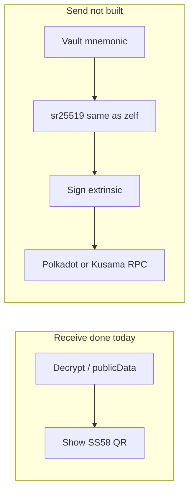

# How hard is send for DOT and KSM?

## What receive already gave you

- **Public addresses** in [`TagPublicData`](verifik-wallet-extension/shared/types/tag.types.ts) via `readPublicDataDotAddress` / `readPublicDataKsmAddress`, decrypt, and UI on Receive/Receive QR.
- That is **read-only**: no local Substrate signing, no `@polkadot/*` in [`package.json`](verifik-wallet-extension/package.json).

So: **address display and “generate address” do not make send “almost done.”** They remove one product blocker (user sees / materializes the address) but not the **signing and broadcasting** path.

## What send requires in this extension

The send stack is **network-specific services + `BlockchainTransactionsService`**.

- [`blockchain-transactions.service.ts`](verifik-wallet-extension/src/app/services/blockchain-transactions.service.ts) `sendTransaction` switches on `network` for: `ethereum`, `polygon`, `binance`, `avalanche`, `solana`, `bitcoin`, `stellar`, `sui`, `blockdag` — **no `polkadot` / `kusama`**.
- [`send-currency.component.ts`](verifik-wallet-extension/src/app/send-currency/send-currency.component.ts) `isTokenSendable` and `onTokenClick` only wire ETH-family, Solana, BTC, Sui, Stellar, BlockDAG, etc. — **no DOT/KSM** branches; balances for send come from `getAddressData` / `processTokensFromResponse` (Polkadot assets must appear in that pipeline or be added via a dedicated balance fetch).
- There are **no** Substrate dependencies in the extension today (contrast: `ethers`, `bitcoinjs`, Solana, Stellar, Sui, etc.).

## Crypto alignment: you are not starting from zero

In the monorepo, [`/Users/miguel/zelf/Repositories/Wallet/modules/polkadot-kusama.js`](file:///Users/miguel/zelf/Repositories/Wallet/modules/polkadot-kusama.js) shows the **intended derivation**: BIP39 mnemonic → `mnemonicToMiniSecret` → `sr25519PairFromSeed` → `encodeAddress` with SS58 **0** (Polkadot) and **2** (Kusama). That is the spec the extension would need to **match** so the same mnemonic controls the same addresses users see in public data.

**Important:** on-chain *send* still needs the **keypair in the client** to sign `balances.transfer` (or similar) against the right chain metadata and RPC, not just the public address string.

## Rough effort buckets

| Area | Effort | Notes |
|------|--------|--------|
| Add `@polkadot/api` (and `util-crypto` if not pulled transitively) + WASM init (`cryptoWaitReady`) in the extension | Medium | Bundle size, extension MV3 constraints, test on Chrome |
| New `Substrate` / per-network services: connect RPC, read balance, estimate fee, build & sign extrinsic, submit | Medium–High | Two relay chains = two RPC configs (Polkadot + Kusama) or one parameterized service |
| Port / share derivation with [`polkadot-kusama.js`](file:///Users/miguel/zelf/Repositories/Wallet/modules/polkadot-kusama.js) and load mnemonic from existing vault path used for other sends | Medium | Must match server-side addresses exactly |
| Wire send UI: `AssetService` permissions, `send-currency` + `send-transaction` + `send-confirm` + fee path in [`BlockchainTransactionsService`](verifik-wallet-extension/src/app/services/blockchain-transactions.service.ts) | Medium | Same pattern as an existing network, but new branches throughout |
| Asset list / balance source | TBD | If portfolio API does not return DOT/KSM yet, you need RPC balance queries or API support |

**Overall:** *conceptually* straightforward if you know Substrate; *practically* a **substantial feature** (on the order of **days to a couple of weeks** depending on API/balance work and QA), not a “flip a switch” after receive.

## Suggested implementation shape (for a future PR)

1. **Derivation module** in the extension (or shared package) mirroring `polkadot-kusama.js`, tested against known vectors / same addresses as decrypt public data.
2. **`SubstrateTransactionService` (or `polkadotService` + `kusamaService`)** implementing `calculateTransactionFees` + `sendTransaction` with the same `TransactionParams` / result types as other chains.
3. **Extend** `BlockchainTransactionsService` switch cases and `getAddressData` / token processing so DOT/KSM appear as sendable when balance > 0 and settings allow.
4. **Validation** in send flow: SS58 for recipient, existential deposit / ED warnings if you expose them in UI.

## Mermaid: receive vs send

**Bottom line:** Address generation and display are **necessary** for product trust; **send is a separate, non-trivial** integration (new chain stack in the extension), but you have a **clear derivation reference** in the Zelf `polkadot-kusama` module to stay consistent.
