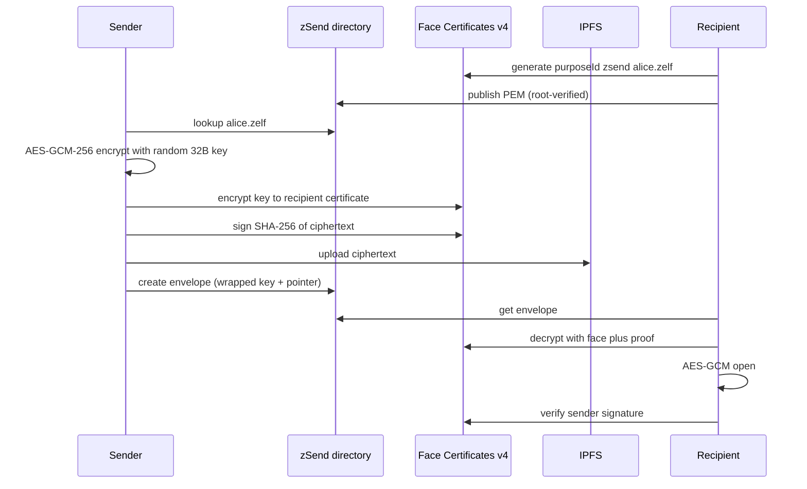

# zSend

Send a payload only the recipient's face can open.

zSend is the first Zelf feature built on **encrypt-to-someone-else**, the one capability [Face Certificates](../FaceCertificates/README.md) add that Zelf Keys does not have. Keys encrypts for yourself; zSend encrypts to a certificate someone else published under their Zelf name.

Client contract and the send/open reference implementation: [CLIENT.md](CLIENT.md).

## Routes

Both route files are registered in `Routes/protected-repositories.js`, so every endpoint requires `Authorization: Bearer <token>` from `POST /api/sessions`. This matches `/api/tags`, which is also JWT-only.

| Path | Auth | Purpose |
| --- | --- | --- |
| `GET /api/zsend/purpose-id` | JWT | Canonical purpose id + crypto parameters for a name |
| `GET /api/zsend/certificates` | JWT | Sender-side directory lookup |
| `GET /api/my-zsend/certificates` | JWT | Directory entries this session published |
| `POST /api/my-zsend/certificates` | JWT | Publish or rotate a certificate |
| `DELETE /api/my-zsend/certificates` | JWT | Revoke a directory entry |
| `POST /api/my-zsend/blobs` | JWT | Pin ciphertext ≤ 5 MB, returns a CID |
| `GET /api/my-zsend/envelopes` | JWT | `box=inbox` or `box=outbox` |
| `POST /api/my-zsend/envelopes` | JWT | Send |
| `GET /api/my-zsend/envelopes/:envelopeId` | JWT | Wrapped key + ciphertext pointer |
| `POST /api/my-zsend/envelopes/:envelopeId/opened` | JWT | Recipient marks opened |
| `DELETE /api/my-zsend/envelopes/:envelopeId` | JWT | Sender revokes |

## Purpose id convention

A Face Certificate binds **one purpose id to one face-derived key pair**. zSend derives the purpose id from the recipient's name so a sender can confirm, before wrapping anything, that the certificate it fetched belongs to the name it typed.

```
zsend:alice.zelf     file transfer
zmail:alice.zelf     message  (Zelf Mail, later)
```

Clients read this from `GET /api/zsend/purpose-id` instead of building the string, so the convention can change in one place. Separate scopes mean a zSend certificate cannot open a Zelf Mail envelope even for the same person.

Convention lives in [`modules/zsend-purpose.module.js`](modules/zsend-purpose.module.js).

## Why the PEM is not in tag `publicData`

Tag `publicData` is Pinata pin metadata: **9 keyvalues, 250 characters each** (see [`Repositories/Tags/modules/tags-addresses.module.js`](../Tags/modules/tags-addresses.module.js)). A Face Certificate PEM is 1–3 KB, and only address fields have a continuation-pin mechanism — and those values must still each fit in 250 characters.

So the directory is a Mongo collection, [`models/zsend-certificate.model.js`](models/zsend-certificate.model.js), keyed by `(tagName, domain, purposeId)`.

Nothing in it is secret. A certificate holds only a public key. Its value is **integrity**, and that comes from `publish` calling the Face PKI `verify` before storing: `https://v4.zelf.world` rejects anything its root did not sign with `ERR_INVALID_CERTIFICATE`. A sender that trusts the directory transitively trusts the pinned root.

## Envelope



Hybrid crypto, because Face Certificate `encrypt` wraps a **32–512 byte key**, not a file:

1. Client generates a fresh 32-byte content key and encrypts the payload locally with **AES-GCM-256** (12-byte nonce). Only AEAD algorithms are accepted, so a tampered blob fails to open rather than decrypting to garbage.
2. Client wraps the content key with `POST /api/my-face-certificates/encrypt`.
3. Client optionally signs the ciphertext digest with `POST /api/my-face-certificates/sign`.
4. `POST /api/my-zsend/envelopes` stores the **wrapped** key, the AEAD parameters, and a pointer. There is no parameter for the raw key or the plaintext. The wrapped key is capped at 8 KB, well above real output, so the directory cannot be used to park arbitrary data.
5. Recipient recovers the key with `POST /api/my-face-certificates/decrypt` — the step that requires the live face — and opens the payload locally.

### Expiry

`expiresInHours` defaults to **72** (the free tier's 3 days) and is capped at **720**. Reads of a lapsed envelope return 404. `pruneExpired()` in [`modules/zsend-envelopes.module.js`](modules/zsend-envelopes.module.js) is the cron entry point: it flips status, clears the wrapped key, and unpins blobs zSend pinned, so an expired transfer stops being openable even if the ciphertext survives elsewhere.

## Security posture

**What holds.** Payload confidentiality never depends on the API or the session. It depends on the recipient's face. A database leak yields wrapped keys and ciphertext pointers, and neither opens anything.

**Recipient authorization comes from the directory, not the JWT.** `POST /api/sessions` accepts any `tagName` with no ownership proof, so that claim cannot gate inbox reads. Instead, publishing a certificate is first-write-wins, and the publishing session identifier is treated as the name's holder. Rotation requires the same identifier; a different one gets 403.

**Known v1 limitation.** That binding is not a cryptographic proof of tag ownership. The hardening step is to require a face-decrypt of the tag's own ZelfProof (as `POST /api/tags/decrypt` does) before a name can be claimed in the directory. Until then, confidentiality is face-bound but *metadata* privacy rests on the session identifier.

**Server-visible metadata.** `filename`, `mimeType`, size, sender, and recipient are stored in the clear so an inbox can render. Payload contents are not. Clients must not imply filenames are private.

## Then Zelf Mail

**Do not start Zelf Mail yet.** Mail is zSend plus a directory plus an inbox plus notifications. Two of those now exist; notifications do not, and email itself drags in SMTP/IMAP, spam, deliverability, retention, and legal process.

The envelope is already shaped so Mail does not need new crypto or a new PKI. The `kind` field carries it:

| Product | Face Certificate role | `kind` | Status |
| --- | --- | --- | --- |
| **zSend** | Encrypt-to-recipient, optional sender signature | `file` | This module |
| **zDrive** | Same wrap, longer-lived blob; share = send to a certificate | `file` | After zSend |
| **Zelf Mail** | Same envelope, `zmail:` purpose scope, ZNS as From/To | `message` | After notifications |
| **zWallet face-claim** | Wrap a claim secret, or require a face signature to release | — | Feature, not a new product |

`kind: "message"` already validates, routes, and stores today — a Mail message is a small JSON payload in the same envelope under a `zmail:` purpose id. What Mail still needs is product surface: an inbox with notifications, threading, and addressing UX. Not cryptography.

## Tests

```bash
PORT=3003 npm run test:zsend
```

Unit tests cover the purpose-id convention, envelope limits, error mapping, and the client's AES-GCM round trip and tamper detection. The integration suite needs a live server on the same `PORT` and asserts auth, validation, and the directory gate. Following the repo's no-mocking policy, the publish path is exercised against the real Face PKI, which is why the suite asserts that an untrusted certificate is refused rather than stubbing a trusted one.

Files: [`tests/unit/zsend-purpose.module.test.js`](../../tests/unit/zsend-purpose.module.test.js), [`tests/unit/zsend-envelope.client.test.js`](../../tests/unit/zsend-envelope.client.test.js), [`tests/integration/zsend-api.test.js`](../../tests/integration/zsend-api.test.js).
