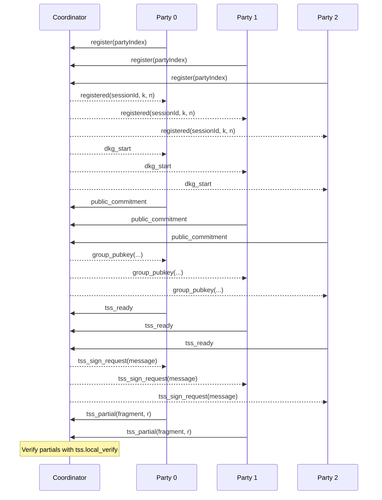

## MPC TSS (DKLS ECDSA) – Demo and Developer Guide

This folder contains a runnable demonstration of an MPC TSS (Multi‑Party Computation Threshold Signature Scheme) flow for ECDSA, built around `@toruslabs/tss-lib` and a lightweight WebSocket coordinator.

The demo shows how multiple parties collaboratively derive a group public key and produce threshold ECDSA signature fragments for a message, without any single party ever holding the full private key.


### What this is (plain‑English)

- **MPC/TSS**: A way for several computers (“parties”) to share responsibility for a secret key and jointly create signatures. No one ever has the whole key.
- **Threshold**: You set a minimum number of parties (k) that must cooperate to sign. With k of n parties participating, signing can happen even if some parties are offline.
- **This demo**: Spins up a coordinator and n party processes locally, derives a session group public key, performs pre‑computation, and demonstrates signing fragments for a message using DKLS routines from `@toruslabs/tss-lib`.


## Quick start

From this directory:

```bash
# Example: 3 parties, threshold 2, named session, and a message to sign
MPC_TSS_MESSAGE="approve:1000 USDC" node run_dkg.js --session session_101 --n 3 --k 2
```

What you’ll see:

- The coordinator listens on `ws://localhost:9090` and assigns/announces the `sessionId`.
- Each party registers, publishes its public commitment, and receives the computed group public key and address.
- Parties run `tss-lib` setup and precompute steps, then signal `tss_ready`.
- If `MPC_TSS_MESSAGE` is set, the coordinator requests a signature. Parties return signature fragments; the coordinator verifies them using `tss.local_verify`.

Outputs are written to `state/<sessionId>/aggregated.json` with the group public key and derived Ethereum address.


## Files

- `coordinator.js`: WebSocket server that orchestrates registration, commitment collection, group key computation, precompute orchestration, and partial signature collection/verification.
- `party.js`: Party client that derives a session share from a persistent mnemonic, publishes a public commitment, runs DKLS setup/precompute, and produces partial signatures.
- `run_dkg.js`: Convenience runner that spawns one coordinator and `n` party processes, then stops them after a short delay.
- `sign_tx.js`: Placeholder for a future end‑to‑end signing orchestrator.


## Installation and prerequisites

1. Node.js 18+ recommended.
2. Install dependencies at repository root (or here if used standalone):
   ```bash
   npm install @toruslabs/tss-lib ws noble-secp256k1 bip39 js-sha3
   ```
3. Ensure the `@toruslabs/tss-lib` package is available. The party code loads its WebAssembly client from the package (`wasm/client.wasm`).


## Environment variables

- **MPC_SESSION_ID**: Override the session identifier. Default is `mpc_tss_<timestamp>`.
- **MPC_TOTAL_PARTIES**: Number of parties `n`. Default: `3` (or value passed via `--n`).
- **MPC_THRESHOLD**: Threshold `k` (minimum parties needed to sign). Default: `2` (or value passed via `--k`).
- **MPC_TSS_COORDINATOR_URL**: Coordinator WebSocket URL for parties. Default: `ws://localhost:9090`.
- **MPC_TSS_MESSAGE**: If set, the coordinator will request signing this message once all parties are ready.
- **MPC_TSS_STATE_DIR**: Directory for state and artifacts. Default: `<repo>/zelf/mpc_tss/state`.


## How it works (technical overview)

### Persistent identity per party

- On first run, each party creates a persistent BIP‑39 mnemonic at `state/party_<i>_mnemonic.json`.
- For each session, the party derives a session‑specific scalar share via `HMAC_SHA256(seed, label)` modulo the secp256k1 curve order. The label includes `partyIndex` and `sessionId`.

### Messaging flow

1. Party connects to coordinator and sends `{ type: "register", partyIndex }`.
2. Coordinator responds with `{ type: "registered", sessionId, threshold, totalParties }`.
3. When all parties are registered, coordinator broadcasts `{ type: "dkg_start" }`.
4. Each party computes `public_commitment` as an uncompressed secp256k1 public key from its session share and sends it.
5. Coordinator computes the group public key by elliptic point addition of all commitments (n‑of‑n sum) and writes `state/<sessionId>/aggregated.json`:
   - `aggregatedPublicKey` (uncompressed hex, 0x04‑prefixed)
   - `address` (Ethereum address derived from uncompressed pubkey)
6. Coordinator broadcasts `{ type: "group_pubkey", publicKey, address, participants, threshold, totalParties, sessionId }` and `{ type: "tss_setup" }`.
7. Each party initializes `tss.threshold_signer` using its share and the group public key, runs `tss.setup(...)` and `tss.precompute(...)`, then sends `{ type: "tss_ready" }`.
8. If `MPC_TSS_MESSAGE` is set, coordinator broadcasts `{ type: "tss_sign_request", message }`.
9. Parties compute a DKLS partial signature using:
   - `msgHashHex = sha256(message)`
   - `fragment = tss.local_sign(msgHashHex, true, precompute)`
   - `r = tss.get_r_from_precompute(precompute)`
   and send `{ type: "tss_partial", fragment, r }`.
10. Coordinator collects at least `k` fragments and verifies them via `tss.local_verify(msg, true, r, sig_frags, groupPubkey)`.

> Note: The coordinator currently verifies partial fragments and returns `{ type: "tss_signature", ok, r, sig_frags }`. Full ECDSA signature assembly for on‑chain use is a planned next step.


### State and artifacts

- `state/party_<i>_mnemonic.json`: Persistent identity for party `i`.
- `state/<sessionId>/aggregated.json`: Session artifact with group public key and Ethereum address.

Example `aggregated.json`:

```json
{
  "sessionId": "session_101",
  "threshold": 2,
  "totalParties": 3,
  "aggregatedPublicKey": "04...",
  "address": "0x...",
  "timestamp": "2025-01-01T00:00:00.000Z"
}
```


## Run options

```bash
# Default values are shown; override via flags or env
node run_dkg.js --session <id> --n <totalParties> --k <threshold>

# With a message to sign (triggers signing once parties are ready)
MPC_TSS_MESSAGE="hello world" node run_dkg.js --session my_session --n 3 --k 2
```

`run_dkg.js` spawns the coordinator and parties, waits briefly for setup (~3s), then terminates the processes. Adjust delays in `run_dkg.js` if you need longer sessions during development.


## Developer notes and gotchas

- The group public key is computed by summing uncompressed commitments. This matches n‑of‑n additive key aggregation; DKLS threshold keygen keeps a fixed group key. Do not treat this as a production DKG.
- `threshold_signer` initialization tries several argument encodings (hex with/without `0x`, base64, compressed/uncompressed pubkey) to accommodate `tss-lib` expectations.
- Signing uses `sha256(message)` for demo purposes. Real transaction signing should hash the canonical transaction payload.
- Coordinator and parties communicate over plain WebSocket on localhost. There is no authentication, TLS, or access control in this demo.


## Security disclaimers

- Mnemonics are stored unencrypted under `state/`. This is for demo only.
- No secure transport or party authentication is implemented.
- Do not use this demo to protect real funds or production keys.


## Troubleshooting

- "threshold_signer_init_failed": Ensure `@toruslabs/tss-lib` is installed and the group public key/share encodings are correct (the code already tries multiple encodings). Check that all parties reached the `group_pubkey` step.
- Port 9090 already in use: Stop the previous coordinator or change the coordinator URL/port.
- No `aggregated.json`: Ensure all parties sent `public_commitment`. Check logs for `[COORD]` and `[PARTY i]` messages.
- No signing triggered: Set `MPC_TSS_MESSAGE` or add a manual trigger in `coordinator.js` after all parties are `tss_ready`.


## Roadmap / next steps

- Implement full DKLS signing rounds and final ECDSA signature assembly.
- Real DKG protocol and verifiable secret sharing instead of additive dummy commitments.
- TLS + auth for coordinator, and persistent peer discovery.
- Replace demo mnemonics with secure, hardware‑backed key material or custody integrations.


### Sequence diagram (high level)




## Contact

For questions or suggestions, open an issue or contact the team in the engineering channel.


